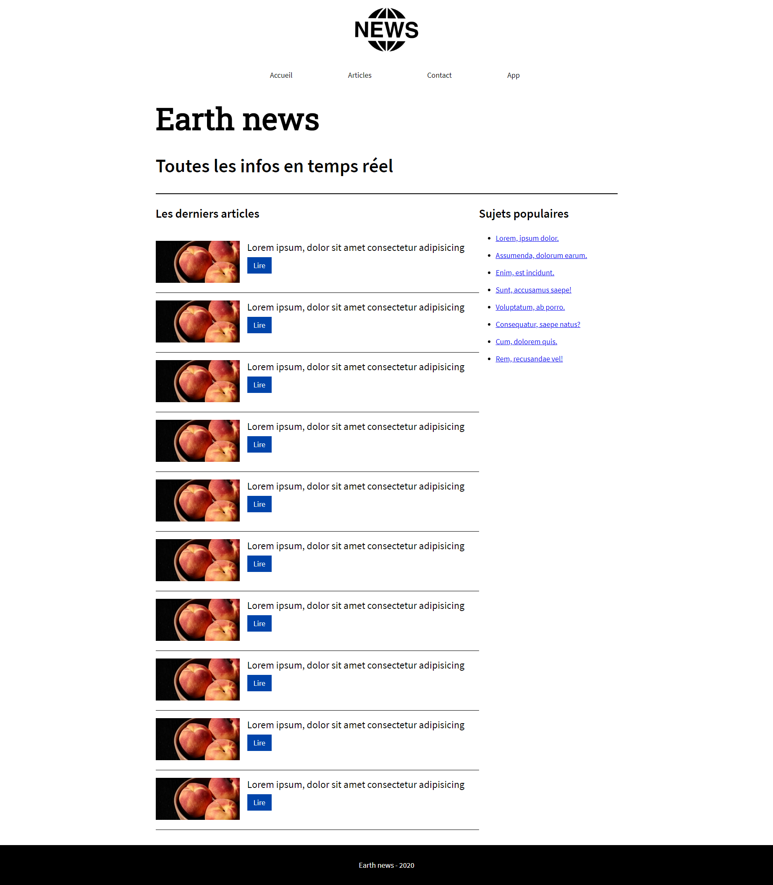
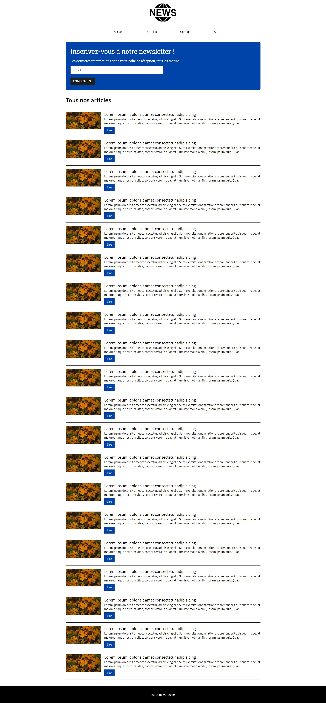
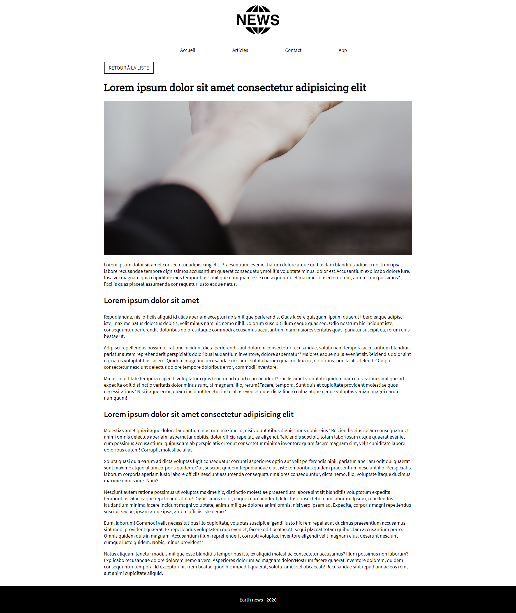
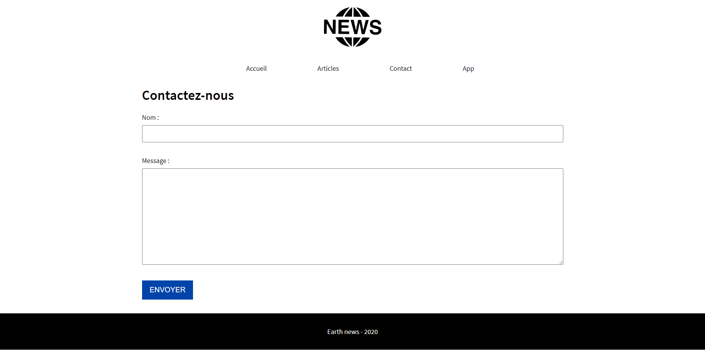

# My Digital School - B1 - Partiel HTML/CSS

Vous allez réaliser la maquette d'un site d'informations.

Pour cela, vous aurez 4 pages à réaliser :

- Accueil
- Liste des articles
- Article seul
- Page de contact

>**Bonus : si vous avez terminé les 4 pages, lisez bien ce document jusqu'à la fin pour trouver une page bonus à réaliser**

## Codes couleurs, logo et polices de caractères

Vous disposez déjà de l'image "logo.png" dans ce dépôt, dossier "images", ça vous fera gagner du temps.

### La liste des codes couleurs

- Bleu du bouton "Lire" dans une liste d'articles : `#0044aa`
- Formulaire de newsletter, couleur d'arrière-plan du bouton : `#1f1f1f`
- Tout le reste est soit du blanc, soit du noir

### Polices de caractères

`Source Sans Pro` et `Roboto Slab` sur Google Fonts.

Epaisseurs :

- Roboto Slab : **Regular 400**
- Source Sans Pro : **Light 300, Semi-bold 600**

### Transitions

**Référez-vous à la [vidéo Youtube](https://youtu.be/IvYiV6ullKo) envoyée !**

## Accueil

## Articles

## Article

## Contact

## App

La page "App" est facultative, vous pouvez la réaliser si vous avez terminé les autres pages.

L'idée est de faire une page de **promotion d'une application mobile** pour ce site d'informations.

**L'apparence est complètement libre, en revanche on ne doit pas retrouver la même structure que les autres pages** : pas de menu ni de footer. Si vous réalisez cette page, faites-vous plaisir avec des images ou vidéos qui prennent tout l'écran par exemple, ou encore superposez des éléments avec des animations, transitions, etc...

>La réalisation de cette page peut apporter des points de bonus ! N'hésitez pas à chercher des choses que nous n'avons pas encore vues et expérimentez des effets CSS plus poussés

**L'utilisation du Javascript est interdite pour cette page.**

>N'hésitez pas à mettre en commentaires dans votre code les possibles liens des ressources que vous aurez explorées, pour que je voie ce que vous avez cherché, et comment vous l'avez exploité
